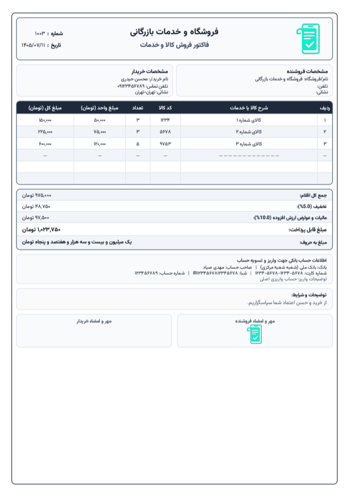
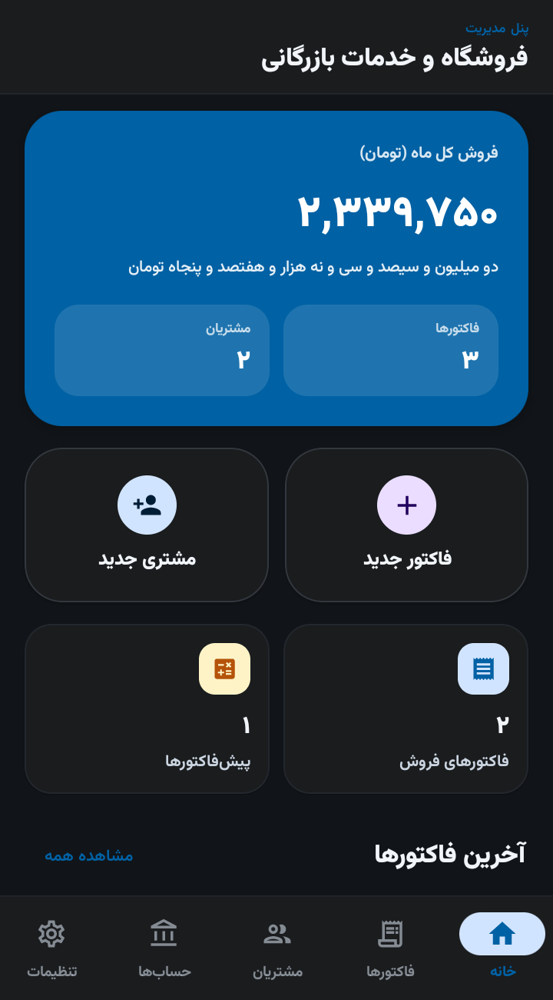

  

  <h1>فاکتور همراه (Factor Hamrah)</h1>

  <h3>نرم‌افزار هوشمند و بومی صدور و مدیریت فاکتور، مشتریان و حساب‌های بانکی برای اندروید</h3>

  <!-- Badges -->
  

    
    
    
    
    
  

   

  <!-- App Screenshot -->
  
  

---

## 📖 درباره برنامه

**فاکتور همراه** یک اپلیکیشن کاملاً بومی (Native)، مدرن و کاربردی برای سیستم‌عامل اندروید است که با استفاده از جدیدترین ابزارهای توسعه اندروید (Kotlin و Jetpack Compose) در محیط توسعه‌ی Gemini Ai Studio طراحی و توسعه داده شده است. این نرم‌افزار به صاحبان کسب‌وکار، فروشگاه‌ها، فریلنسرها و بازرگانان امکان می‌دهد تا بدون نیاز به رایانه یا نرم‌افزارهای پیچیده حسابداری، در کمترین زمان ممکن پیش‌فاکتور و فاکتور فروش رسمی صادر کنند، سوابق مشتریان را تحلیل نمایند و فاکتورهای PDF بسیار شکیل و استاندارد با چاپ لوگو و مُهر اختصاصی تحویل مشتری دهند.

---

## ✨ امکانات و قابلیت‌های کلیدی

### ۱. صدور و مدیریت فاکتور و پیش‌فاکتور
* 📄 **تفکیک فاکتور فروش و پیش‌فاکتور:** امکان جابه‌جایی سریع نوع فاکتور با رنگ‌بندی و برچسب‌های متمایز.
* 🔢 **شماره‌گذاری هوشمند و خودکار:** تشخیص خودکار بالاترین شماره فاکتور موجود و درج شماره فاکتور بعدی.
* 🧮 **محاسبات مالی دقیق:** محاسبه خودکار جمع ردیف‌ها، تخفیف درصدی و مبلغی، مالیات بر ارزش افزوده (VAT) و مبلغ خالص نهایی.
* ✍️ **تبدیل خودکار مبالغ به حروف فارسی:** درج رقم نهایی به صورت نوشتاری (حروف) در فاکتور و فایل PDF.
* 📑 **تکثیر و بازتولید فاکتور:** کپی فوری فاکتورهای پیشین تنها با یک کلیک جهت صرفه‌جویی در زمان.
* 📅 **تقویم و تاریخ شمسی بومی:** بدون نیاز به کتابخانه‌های سنگین، مجهز به تقویم شمسی اختصاصی و دیالوگ انتخاب تاریخ.

### ۲. موتور چاپ و خروجی استاندارد PDF
* 🎨 **تم‌های رنگی چشم‌نواز:** امکان تغییر تم رنگی فاکتورهای خروجی (قرمز رسمی، سرمه‌ای، سبز زمردی، بنفش سلطنتی، خاکستری مدرن و کهربایی).
* 📐 **ابعاد استاندارد A4:** طراحی پیکسل‌به‌پیکسل سازگار با فرمت استاندارد برگه A4 جهت چاپ روی کاغذ یا اشتراک دیجیتال.
* 🖼 **پشتیبانی از لوگو و مُهر/امضا:** امکان بارگذاری تصویر لوگوی فروشگاه و مهر/امضای رسمی فروشنده و درج باکیفیت در فاکتور.
* 🔒 **خطوط امنیتی ضد دستکاری:** بستن انتهای جداول با خط‌چین پس از پایان اقلام برای جلوگیری از هرگونه دستکاری احتمالی.

### ۳. مدیریت ارتباط با مشتریان (CRM سبک)
* 👥 **پروفایل اختصاصی مشتری:** ذخیره نام، شماره تلفن، آدرس و یادداشت‌های مربوط به هر مشتری.
* 📊 **تحلیل هوشمند و مرتب‌سازی آماری:** رتبه‌بندی مشتریان بر اساس بیشترین مبلغ خرید، بیشترین تعداد فاکتور فروش یا پیش‌فاکتور.
* 📞 **ارتباط مستقیم:** تماس تلفنی یا ارسال پیامک مستقیم از داخل برنامه به مشتری.
* 📤 **خروجی لیست شماره‌ها:** امکان استخراج تمام شماره‌های تماس مشتریان به صورت فایل متنی (TXT) جهت کمپین‌های پیامکی.

### ۴. اطلاعات بانکی و تسویه حساب
* 💳 **بانک حساب‌های تسویه:** ثبت مشخصات نام بانک، شماره حساب، شماره کارت ۱۶ رقمی و شماره شبا (IBAN).
* 📋 **کپی سریع اطلاعات:** کپی مجزای شماره کارت یا شماره شبا با یک کلیک.
* ⭐ **حساب پیش‌فرض:** تعیین حساب اصلی جهت درج خودکار در فاکتورهای جدید.

### ۵. امنیت و پشتیبان‌گیری داده‌ها
* 💾 **پشتیبان‌گیری دستی و بازیابی (JSON):** خروجی گرفتن از تمام دیتابیس در قالب فایل استاندارد JSON و اشتراک آن در پیام‌رسان‌ها یا درایو ابری.
* ⏱ **بکاپ خودکار در پس‌زمینه (WorkManager):** قابلیت زمان‌بندی پشتیبان‌گیری دوره‌ای (روزانه، هفتگی، ماهانه) در پس‌زمینه سیستم.
* 🌓 **پشتیبانی از حالت تیره و روشن (Dark/Light Mode):** سازگار با پوسته انتخابی کاربر یا تم خودکار سیستم‌عامل.

---

## 🛠 پشته فنی و معماری نرم‌افزار

این پروژه با بهره‌گیری از الگوهای استاندارد و توصیه‌شده گوگل (**Modern Android Development - MAD**) و معماری تمیز چندلایه‌ای پیاده‌سازی شده است:

| لایه / بخش | ابزار و کتابخانه‌ها |
| :--- | :--- |
| **زبان و فریم‌ورک** | [Kotlin 2.2](https://kotlinlang.org/) / Kotlin Coroutines & Flow |
| **رابط کاربری (UI)** | [Jetpack Compose](https://developer.android.com/jetpack/compose) + [Material 3](https://m3.material.io/) |
| **معماری** | MVVM (Model-View-ViewModel) + Repository Pattern |
| **دیتابیس آفلاین** | [Room Database](https://developer.android.com/training/data-storage/room) (SQLite) با KSP |
| **موتور تولید PDF** | بومی اندروید (`android.graphics.pdf.PdfDocument`) با طراحی وکتور و Canvas |
| **سریال‌سازی داده‌ها** | [Moshi Kotlin Codegen](https://github.com/square/moshi) |
| **لود تصاویر** | [Coil Compose](https://coil-kt.github.io/coil/) |
| **پردازش پس‌زمینه** | AndroidX WorkM
| **حداقل اندروید مورد نیاز** | اندروید 7.0 (API 24)
| **نسخه هدف** | اندروید 16 (API 36)
